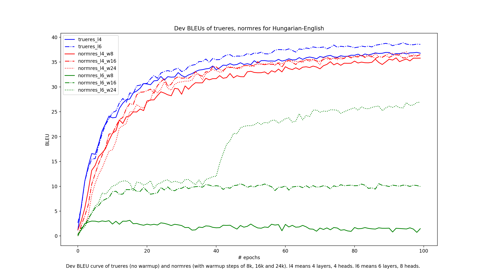
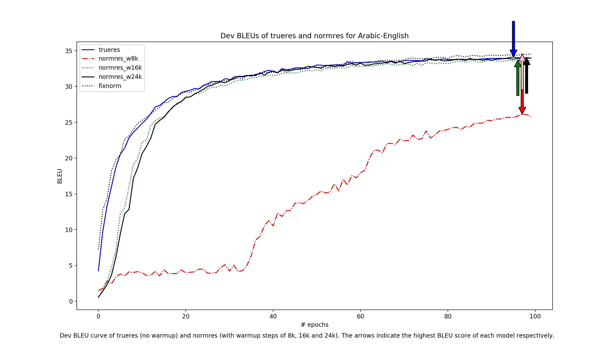

# Witwicky: An implementation of Transformer in PyTorch

[Toan Q. Nguyen](http://tnq177.github.io), University of Notre Dame  

__UPDATE__: Please check out new paper (which is partly based on this work) which has further discussions on TrueRes, NormRes, weight initializations and normalization here [paper](https://arxiv.org/pdf/1910.05895.pdf), [code](https://github.com/tnq177/transformers_without_tears).  

An implementation of Vaswani et al.'s [Attention Is All You Need](https://papers.nips.cc/paper/7181-attention-is-all-you-need.pdf) with [PyTorch](https://pytorch.org). An [early version](https://github.com/tnq177/nmt_text_from_non_native_speaker) of this code was used in our paper [Neural Machine Translation of Text from Non-Native Speakers
](https://arxiv.org/abs/1808.06267).  

It performs very well on both low-resource and high-resource translation tasks, sometimes 5 BLEU higher than other published Transformer baselines (see [Benchmarks](#benchmarks)), and it supports minibatched beam search decoding.

This code has been tested with only Python 3.6 and PyTorch 1.0.

## Input and Preprocessing

The code expects bitext data with filenames

    train.src_lang   train.trg_lang
    dev.src_lang     dev.trg_lang
    test.src_lang    test.trg_lang

My rule of thumb for data preprocessing (learned from fairseq's code) is:  

* tokenize data
* filter out sentences longer than 80 tokens
* learn BPE
* apply BPE
* do not filter sentences by length again (that is, set `max_train_length` to something very high like 1000; see below).

## Usage

To train a new model:  
* Write a new configuration function in ``configurations.py``  
* Put preprocessed data in ``nmt/data/model_name`` or as configured in ``data_dir`` option in your configuration function  
* Run: ``python3 -m nmt --proto config_name``  

During training, the model is validated on the dev set, and the best checkpoint is saved to ``nmt/saved_models/model_name/model_name-SCORE.pth``.

The `val_by_bleu` option controls whether the best checkpoint is chosen based on dev BLEU score (`val_by_bleu=True`) or (label-smoothed) dev perplexity (`val_by_bleu=False`).

The ``n_best`` option tells the trainer to save the best `n_best` checkpoints; however, it's a bug that because of the way the checkpoints are named, if two checkpoints happen to have the same score, the earlier one is overwritten.

When training is finished, the best checkpoint is reloaded and used for decoding the test file. To decode another file, run ``python3 -m nmt --proto config_name --mode translate --model-file path_to_checkpoint --input-file path_to_file_to_decode``.  

We support minibatched beam search, but currently it's quite ad-hoc. We assume that during training, if a minibatch size of ``batch_size`` doesn't run out of memory, during beam search we can use a minibatch size of ``batch_size//beam_size`` (see ``get_trans_input`` function in ``data_manager.py``).

## Options

Options are set in `configurations.py`. Many are pretty important.

* ``norm_in``: If False, perform layer normalization as described in the original Transformer paper, that is, dropout⟶residual-add⟶layer-norm. If True, the order is layer-norm⟶dropout⟶residual-add, as noted in Chen et al.'s '[The Best of Both Worlds: Combining Recent Advances in Neural Machine Translation](https://arxiv.org/pdf/1804.09849.pdf) for ensuring good model performance.

* ``fix_norm``: implement the fixnorm method in our paper [Improving Lexical Choice in Neural Machine Translation](https://aclweb.org/anthology/N18-1031) (though a tad different)

* `warmup_style`: Possible values are ``ORG_WARMUP``, ``FIXED_WARMUP``, ``NO_WARMUP``, and ``UPFLAT_WARMUP``.
    - ``ORG_WARMUP`` follows the formula in the [original paper](https://papers.nips.cc/paper/7181-attention-is-all-you-need.pdf): increase the learning rate linearly for `warmup_steps` steps, then decay with the inverse square root of the step number (but never less than `min_lr`).
    - ``FIXED_WARMUP`` means increase the learning rate linearly from ``start_lr`` to ``lr`` in `warmup_steps` steps, then decay with inverse square root of update steps (but never less than `min_lr`).
    - ``NO_WARMUP`` means no warmup at all, and learning rate is decayed if dev performance does not improve. We can decide when to decay either based on dev BLEU or dev perplexity by changing the option ``val_by_bleu``. We can control the decay patience for ``NO_WARMUP`` with ``patience`` option too.  
    - ``UPFLAT_WARMUP`` means learning rate increases linearly like ``FIXED_WARMUP``, then stays there and decays only if dev performance is not improving, like ``NO_WARMUP``.  

* ``tied_mode``:
    - ``TRG_TIED``: Tie target input and output embeddings
    - ``ALL_TIED``: Tie source embedding and target input, output embeddings
    - ``share_vocab``: For ``ALL_TIED``. If False, we only share the embeddings for common types between source and target vocabularies. This is done by simply masking out those not in target vocabulary in the output layer before softmax (set to -inf). If True, we don't do the masking.

* ``max_train_length``: Maximum length of training sentences. Any sentence pair of length less than this is discarded during training.

* ``vocab_size``: If set to 0, it means we don't do vocabulary cut-off.

* ``joint_vocab_size``: Similar vocab size but for the joint vocabulary when we use ``ALL_TIED``.

* ``word_drop``: This is [word dropout](https://www.aclweb.org/anthology/W16-2323), but instead of setting word embeddings to zero, we replace dropped tokens with `UNK`.

## Recommendations

### General

For low-resource (&lt;500k sentences), try `word_drop=0.1`, ``dropout=0.3``. For datasets of this size, I find BPE of 8k-12k is enough. Since the vocabulary is small, just set ``vocab_size`` and ``joint_vocab_size`` to 0 which means to use the full vocabulary. If the source and target languages are similar, such as English and German, such that their subword vocabularies have 90+% overlap, set ``share_vocab`` to True.

I find gradient clipping at 1.0 helps stabilize training a bit and yields a small improvement in perplexity, so I always do that.

Long sentences are an important resource for Transformer, since it doesn't seem to generalize well to longer sentences than those seen during training (see [Training Tips for the Transformer Model](https://ufal.mff.cuni.cz/pbml/110/art-popel-bojar.pdf)). For this reason, I suggest to set ``max_train_length`` to high value such as 1000.  

I find ``fix_norm`` no longer consistently helps with Transformer + BPE. However, it speeds up training a lot in early epochs and the final performance is either slightly better or the same, so give it a try.

### To Norm or Not To Norm

Section 3 of [Identity Mappings in Deep Residual Networks](https://arxiv.org/pdf/1603.05027.pdf) suggests that residual connections should be left untouched for healthy back-propagation. I conjecture that this is why doing dropout⟶residual-add⟶layer-norm (left side of above figure, let's call it NormRes) is difficult to train without warmup. On the other hand, with layer-norm⟶dropout⟶residual-add (right side of above figure, let's call it TrueRes), we actually don't need warmup at all.

However, in order to achieve good performance, it is still important to decay the learning rate. We choose to decay if the performance on dev set is not improving over some ``patience`` previous validations. We often set ``patience`` to 3.

The figure below shows the dev BLEU curve for Hungarian-English (from LORELEI) with different model sizes and different warmup steps. Note that for all TrueRes models we don't do warmup. We can see that while the NormRes learns well with 4 layers, going to 6 layers causes a huge drop in performance. With TrueRes, we can also train a 6-layer model for this dataset which gives almost 2 BLEU gain.

The story is quite different with Arabic-English (and other TED datasets) though. For this dataset, both NormRes and TrueRes end up at about the same BLEU score. However, we can see that NormRes is very sensitive to the warmup step. Note that the TED talk datasets are fairly big (around 200k examples each) so I always use 6 layers.

### How long to train

It's common to train Transformer for about 100k iterations. This works out to be around 4-50 epochs for Arabic-English. However, we can see that from epoch 50 to 100 we can still get some good gain. Note that for all models here, we use a minibatch size of 4096 tokens instead of 25k tokens. My general rule of thumb is for datasets of around 50k-500k examples, we should train around 100 epochs. Coming from LSTM, Transformer is so fast that training a bit longer still doesn't seem to take much time. See table below for some stats:  

|                                         | ar2en | de2en | he2en | it2en |
|-----------------------------------------|-------|-------|-------|-------|
| # train examples                        | 212k  | 166k  | 210k  | 202k  |
| # dev examples                          | 4714  | 4148  | 4515  | 4547  |
| # test examples                         | 5953  | 4491  | 5508  | 5625  |
| # train target tokens                   | 5.1M  | 3.8M  | 5M    | 4.7M  |
| Training speed (# target tokens/second) | 10.2k | 9.2k  | 10.2k | 9.3k  |
| Total time for 100 epochs (hours)       | ~19   | ~16   | ~18   | ~20   |    

## Benchmarks

Below are some benchmarks and comparison between this code and some published numbers. For all ``this-code`` models, we don't use warmup, we start out with learning rate 3&times;10-4, and decay with factor 0.8 if dev BLEU is not improving compared to previous ``patience`` (=3) validations.

### LORELEI
All use 8k BPEs. Detokenized BLEU.

|                                                            | ha   | hu   | tu   | uz   |
|------------------------------------------------------------|------|------|------|------|
| [Nguyen and Chiang](https://aclweb.org/anthology/N18-1031), LSTM | 22.3 | 27.9 | 22.2 | 21   |
| this-code (4 layers, 4 heads)                                | 25.2 | 30.2 | 24.1 | 24.1 |
| this-code (6 layers, 8 heads)                                | 24.2 | 32   | 24.6 | 24.7 |
| this-code + fixnorm (6 layers, 8 heads)                      | 25.1 | 31.8 | 25.5 | 24.9 |

### IWSLT/KFTT
Tokenized BLEU to be comparable to previous work.  

* En-Vi from [Effective Approaches to Attention-based Neural Machine Translation](https://nlp.stanford.edu/projects/nmt/), 8k joint BPE and word-based.
* KFTT En2Ja from [Incorporating Discrete Translation Lexicons into Neural Machine Translation](https://aclweb.org/anthology/D16-1162), word-based.
* Others from [When and Why are Pre-trained Word Embeddings Useful for Neural Machine Translation?
](https://github.com/neulab/word-embeddings-for-nmt), 12k joint BPE.

I'm pretty surprised we got much better BLEU than the multilingual baseline. Note that all of my baselines are bilingual only.

|                                                                                                      | en2vi              | ar2en | de2en | he2en | it2en | KFTT en2ja           |
|------------------------------------------------------------------------------------------------------|--------------------|-------|-------|-------|-------|----------------------|
| [Massively Multilingual NMT-baseline](https://arxiv.org/abs/1903.00089)                              | ---                | 27.84 | 30.5  | 34.37 | 33.64 | ---                  |
| [Massively Multilingual NMT-multilingual](https://arxiv.org/abs/1903.00089)                          | ---                | 28.32 | 32.97 | 33.18 | 35.14 | ---                  |
| [SwitchOut](https://arxiv.org/pdf/1808.07512.pdf), word-based, transformer                           | 29.09              | ---   | ---   | ---   | ---   | ---                  |
| [duyvuleo's transformer dynet](https://github.com/duyvuleo/Transformer-DyNet), transformer, ensemble | 29.71 (word-based) | ---   | ---   | ---   | ---   | 26.55 (BPE+ensemble) |
| [Nguyen and Chiang](https://aclweb.org/anthology/N18-1031), LSTM, word-based                         | 27.5               | ---   | ---   | ---   | ---   | 26.2                 |
| this-code (BPE)                                                                                      | 31.71              | 33.15 | 37.83 | 38.79 | 40.22 | ---                  |
| this-code + fixnorm (BPE)                                                                            | 31.77              | 33.39 | 38.15 | 39.08 | 40.33 | ---                  |
| this-code, word-based                                                                                | 29.47 (4layers)    | ---   | ---   | ---   | ---   | 31.28 (6layers)      |

## References

Parts of code/scripts are borrowed/inspired from:  

* https://github.com/pytorch/fairseq
* https://github.com/tensorflow/tensor2tensor
* https://github.com/EdinburghNLP/nematus/
* https://github.com/mila-iqia/blocks
* https://github.com/moses-smt/mosesdecoder
