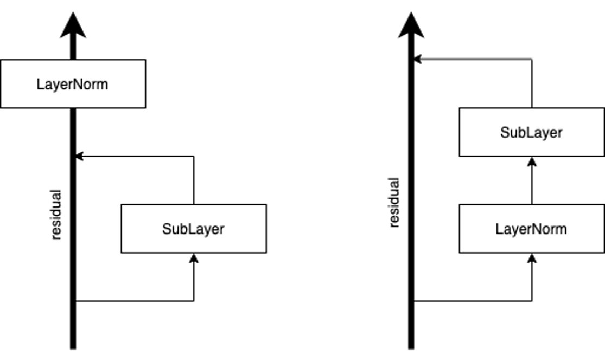

# Transformer in Pytorch

An [early version](https://github.com/tnq177/nmt_text_from_non_native_speaker) of this code was used for [Neural Machine Translation of Text from Non-Native Speakers
](https://arxiv.org/abs/1808.06267).

## Hyperparameters
To train a new model, write new config function in ``configurations.py``. I know all of them look the same and can be refactored but I'm lazy.  

Many of hyperparameters are pretty important, take a look at ``all_constants.py`` before read on:

* ``norm_in``: If it's False, it's the default Transformer's computational sequence, that is, we do dropout-->residual-add-->layernorm. If false, it's goes layernorm-->dropout-->residual-add. See below image for visualization. This is fairly important. I've encountered a bunch of datasets (LORELEI) that doing the former can cause all sort of problem and make it impossible to train a 6-layer model. The latter is the right way to do residual connection which also enables us to **not using warmup at all**.  

* ``fix_norm``: implement the fixnorm in this [paper](https://aclweb.org/anthology/N18-1031) (though a tad different, like we don't normalize the final output from decoder since it can be underfitting, or instead of l2 norm, we normalize. Both give the same performance though). I've found that it no longer helps if we're using subword units, transformer and enough data (>100k sentences). But it doesn't hurt, and it trains really fast in the first 10 epochs or so so if you're on a budget, give it a try.

* warmup: There are ``ORG_WARMUP``, ``FIXED_WARMUP``, ``NO_WARMUP``, and ``UPFLAT_WARMUP``. The ``ORG_WARMUP`` follows the formula in [original paper](https://papers.nips.cc/paper/7181-attention-is-all-you-need.pdf). ``FIXED_WARMUP`` means going from ``start_lr`` to ``lr`` in some warmup steps then decays with inverse sqrt of update steps. ``NO_WARMUP`` means no warmup at all, and learning rate is decayed if dev performance is not improving. We can decide to decay either with dev BLEU or dev perp by changing the option ``val_by_bleu``. We can control the decay patience for ``NO_WARMUP`` with ``patience`` option too.  

* we do batched beam search, pretty fast.  

* ``tied_mode``: It's best to always tie target input and output embedding -> ``TRG_TIED``. Sometimes, we want to tie all three, thus ``ALL_TIED``. Sometimes, the source and target languages only share a subset of their vocabs, so we will only share embeddings for the common subwords. To do this set ``share_vocab`` to ``False``. For similar languages such as English, German, Spanish... set it to ``True`` since they share like 90+% of their vocabs.  

* ``max_train_length``: Just set it to some really high value, like 1000 by default. This use all training sentences of length up to this value. Transformer can't go beyond its known length during training, thus using up all long sentences is important. I find it impossible to reproduce WMT14 En2De result (using fairseq's data) without setting this to high value. I tried 256 and it was 1 BLEU below.  

* ``vocab_size``: If you're using BPE, just set them all to 0, which means we use the whole vocab. Using BPE reduces the vocab size significantly, so there's no need to worry. In my experience, if your dataset is of < 500k sentences, and if src and tgt languages are similar, use BPE from 8000-12000 are sufficient.  

* ``word_drop``: This is [word dropout](https://www.aclweb.org/anthology/W16-2323) but instead of setting word embeds to zero, we replace dropped tokens with UNK. I find this help with  every low-resource dataset I've worked on (<500k sents), but makes training slower for high resource (WMT14 EnDe 4.5M sents). 

## Training
I've tested only with python3.6 & pytorch1.0. My rule of thumb for data preprocessing is (learned from fairseq's code):  

* tokenize data
* length-limit around 80 tokens
* learn bpe from that 80-token-long data
* apply bpe
* use all of them (**don't limit training sentence length again**)

After you've preprocessed data, create a folder in ``nmt/data/model_name`` (see ``data_dir`` option in config function). Then to train:  

``python3 -m nmt --proto config_func_name``  

Checkpoints are saved in ``nmt/saved_models/model_name``. The ``n_best`` option is incorrect, just set it to 1 and it'll always save the best checkpoint. Currently I save checkpoint along with its best score on dev, which means multiple checkpoints might have the same name and that causes overwriting old checkpoint, thus n_best > 1 doesn't guarantee more than 1 best checkpoints. Anw, just set it to 1.  

To decode:  

``python3 -m nmt --proto config_func_name --model-file path_to_checkpoint --input-file path_to_input_file``  

## Benchmarks
The most important thing I've learned while working on this code is we **don't need warmup at all** if **we set norm_in to True**. I find this fact is pretty data-dependent. That is, for some dataset such as the TED talk datasets, ``norm_in`` True or False doesn't matter much if we do careful warmup, but this breaks for some LORELEI datasets. However, ``norm_in`` to True allows us to not use warmup at all and the performance is just the same or even better for some LORELEI datasets.  

Below are some benchmarks and comparison between this code and some published numbers. Note that **THE COMPARISON IS NOT FAIR** since some use LSTM, some may have trained less, and so on. I always use 6 layers, 8 heads, 512D (Transformer base) unless stated otherwise. My rule of thumb is for datasets less than 10k sentences, train 300 epochs. For 50k, you can go 100-200 epochs. For 100k-500k, 100 epochs are enough. I don't have much experience with high-resource languages even though I did get 27.4 for WMT14 EnDe if trained for 24 epochs which took about 6 days using 1080ti. **All ``this-code`` numbers are without warmup**.  

### LORELEI benchmarks
All use 8k BPEs.

|                                                            | ha   | hu   | tu   | uz   |
|------------------------------------------------------------|------|------|------|------|
| [Nguyen and Chiang](https://aclweb.org/anthology/N18-1031) | 22.3 | 27.9 | 22.2 | 21   |
| this-code (4layers, 4heads)                                | 25.2 | 30.2 | 24.1 | 24.1 |
| this-code (6layers, 8heads)                                | 24.2 | 32   | 24.6 | 24.7 |
| this-code + fixnorm (6layers, 8heads)                      | 25.1 | 31.8 | 25.5 | 24.9 |

### IWSLT/KFTT benchmarks
En-Vi from [Effective Approaches to Attention-based Neural Machine Translation
](https://nlp.stanford.edu/projects/nmt/), use 8k joint BPE (I also added word-based number). Others from [When and Why are Pre-trained Word Embeddings Useful for Neural Machine Translation?
](https://github.com/neulab/word-embeddings-for-nmt). KFTT En2Ja from [Incorporating Discrete Translation Lexicons into Neural Machine Translation](https://aclweb.org/anthology/D16-1162).  For ar2en, de2en, he2en, it2en, we use 12k joint BPE. For En2Ja, it's word-based. I'm pretty surprised we got much better BLEU than the multilingual baseline. Note that all of my baselines are bilingual only.

|                                                                                                      | en2vi              | ar2en | de2en | he2en | it2en | KFTT en2ja           |
|------------------------------------------------------------------------------------------------------|--------------------|-------|-------|-------|-------|----------------------|
| [Massively Multilingual NMT-baseline](https://arxiv.org/abs/1903.00089)                              | ---                | 27.84 | 30.5  | 34.37 | 33.64 | ---                  |
| [Massively Multilingual NMT-multilingual](https://arxiv.org/abs/1903.00089)                          | ---                | 28.32 | 32.97 | 33.18 | 35.14 | ---                  |
| [SwitchOut](https://arxiv.org/pdf/1808.07512.pdf), word-based, transformer                           | 29.09              | ---   | ---   | ---   | ---   | ---                  |
| [duyvuleo's transformer dynet](https://github.com/duyvuleo/Transformer-DyNet), transformer, ensemble | 29.71 (word-based) | ---   | ---   | ---   | ---   | 26.55 (BPE+ensemble) |
| [Nguyen and Chiang](https://aclweb.org/anthology/N18-1031), LSTM, word-based                         | 27.5               | ---   | ---   | ---   | ---   | 26.2                 |
| this-code (BPE)                                                                                      | 31.71              | 33.15 | 37.83 | 38.79 | 40.22 | ---                  |
| this-code, word-based                                                                                | 29.47 (4layers)    | ---   | ---   | ---   | ---   | 31.28 (6layers)      |

### References
Parts of code/scripts are borrowed/inspired from:  

* https://github.com/pytorch/fairseq
* https://github.com/tensorflow/tensor2tensor
* https://github.com/EdinburghNLP/nematus/
* https://github.com/mila-iqia/blocks
* https://github.com/moses-smt/mosesdecoder

and thanks Kyunghyun Cho for making me switch from Tensorflow to Pytorch, it was life-changing.